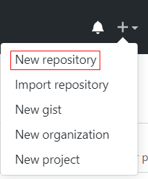
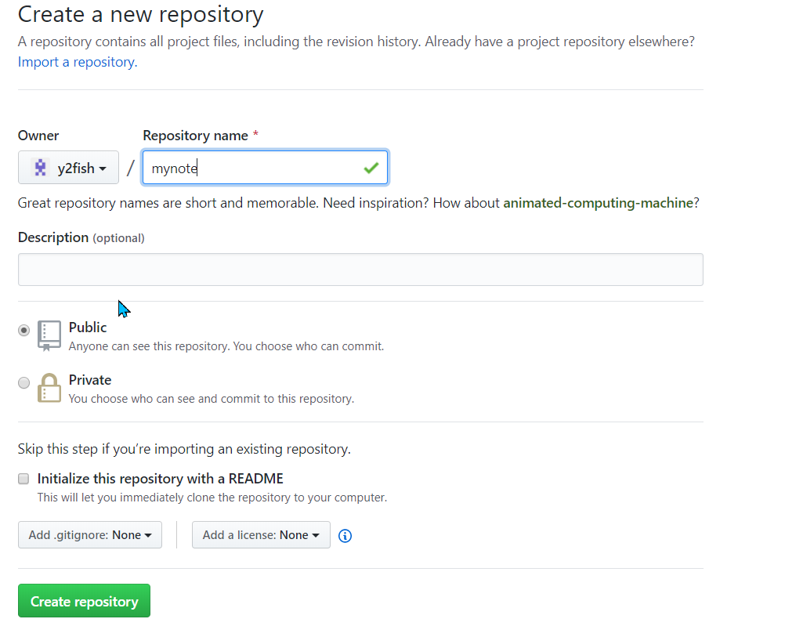
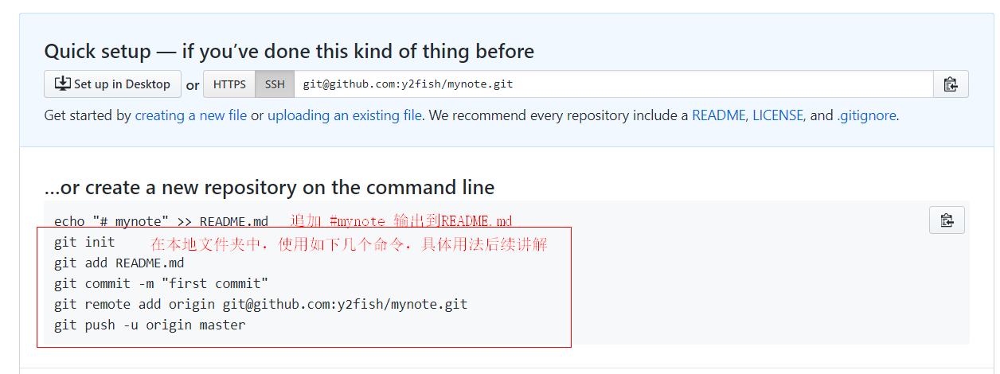
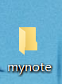
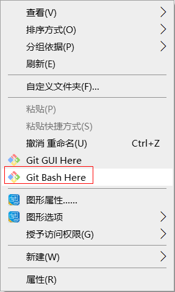
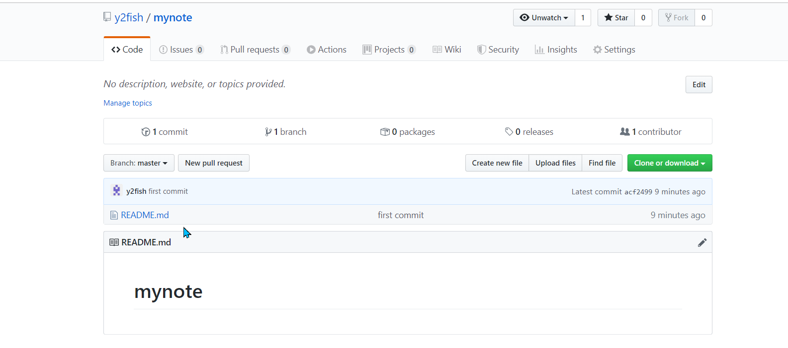
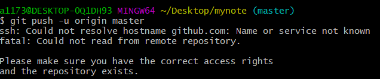

# GitHub简明使用教程

## 1.新建远程仓库

登陆GitHub新建一个repo仓库



点击之后出现如下界面，其中只需要填写**Repository name**

> Repository name这个名字最好与本地的文件夹名字一致



点击**Create repository**，会出现如下一个提示



## 2.新建本地文件

本地新建一个和刚刚repo一样的本地文件夹



进入mynote目录里面，右键选择 git bash here



依次运行如下几个在命令

```shell
echo "# mynote" >> README.md
git init
git add README.md
git commit -m "first commit"
git remote add origin git@github.com:y2fish/mynote.git
git push -u origin master
```

具体效果如下

```shell

a1173@DESKTOP-0Q1DH93 MINGW64 ~/Desktop/mynote
$ echo "# mynote" >> README.md

a1173@DESKTOP-0Q1DH93 MINGW64 ~/Desktop/mynote
$ git init
Initialized empty Git repository in C:/Users/a1173/Desktop/mynote/.git/

a1173@DESKTOP-0Q1DH93 MINGW64 ~/Desktop/mynote (master)
$ git add README.md
warning: LF will be replaced by CRLF in README.md.
The file will have its original line endings in your working directory

a1173@DESKTOP-0Q1DH93 MINGW64 ~/Desktop/mynote (master)
$ git commit -m "first commit"
[master (root-commit) acf2499] first commit
 1 file changed, 1 insertion(+)
 create mode 100644 README.md

a1173@DESKTOP-0Q1DH93 MINGW64 ~/Desktop/mynote (master)
$ git remote add origin git@github.com:y2fish/mynote.git

a1173@DESKTOP-0Q1DH93 MINGW64 ~/Desktop/mynote (master)
$ git push -u origin master
ssh: Could not resolve hostname github.com: Name or service not known

```


配置邮箱后，再使用报错的那条命令

```shell
a1173@DESKTOP-0Q1DH93 MINGW64 ~/Desktop/mynote (master)
$ git config user.email '18203093012@163.com'

a1173@DESKTOP-0Q1DH93 MINGW64 ~/Desktop/mynote (master)
$ git push -u origin master

```

最后的效果如下



## 3总结

配置好环境变量之后，就只需要运行如下两个命令

```shell
git add filename
git commit -m '修改日志'
git push -u origin master
```

 git push -u origin master一般的IDE不需要这一步，add,commit就行


```shell
 git add img/      //这是添加文件夹
```


## 4如果报错



[解决方案](https://blog.csdn.net/weixin_44394753/article/details/91410463)

