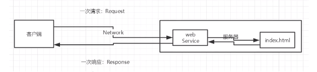
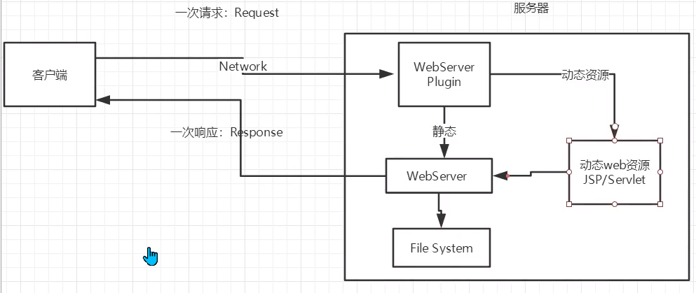
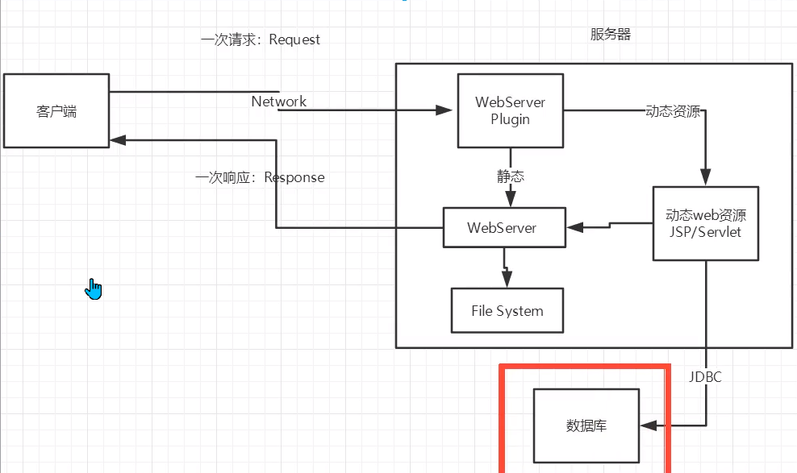
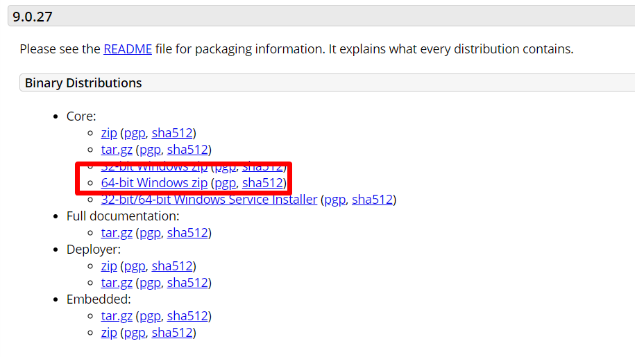
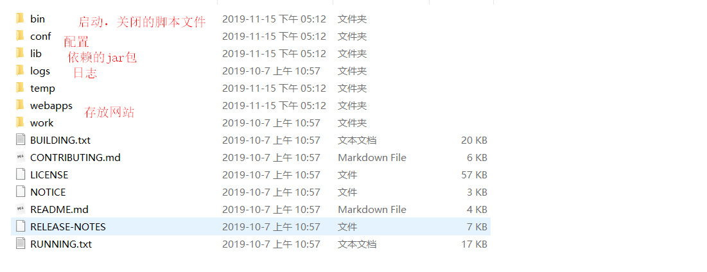
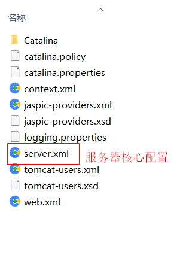
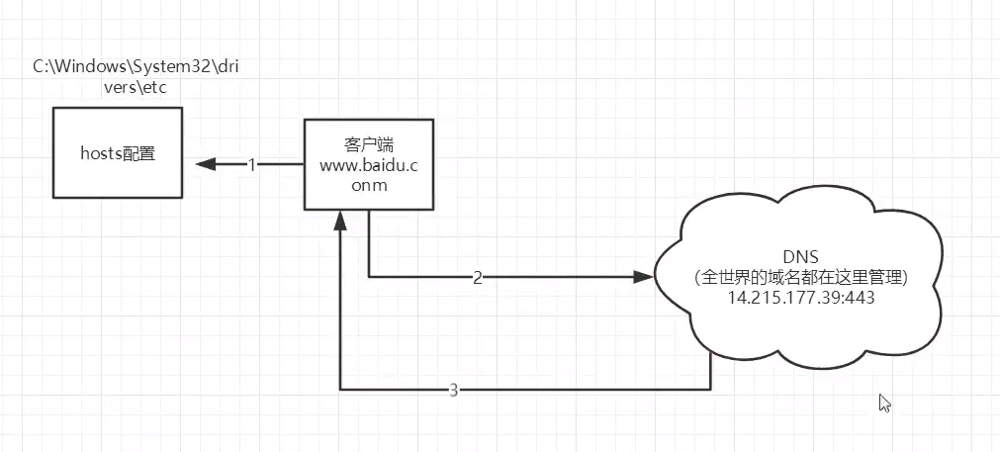

# Javaweb	

Java web

## 1、基本概念

### 1.1 前言

web开发：

- web ,网页的意思
- 静态web
  - html，css
  - 提供给所有人看的数据始终不会发生变化！
- 动态web
  - 几乎所有网站都是动态的；
  - 提供给所有人看的数据始终会发生变化，每个人在不同的时期，不同的地点看到的信息各不相同
  - 技术栈：servlet/jsp ASP PHP
- 在java中，动态web资源开发的技术统称为Javaweb

### 1.2 web应用程序

web应用程序：可以提供浏览器访问的程序

- a.html,b.html.......多个web资源，这些web资源可以被外界访问，为外界提供服务；
- 你们能访问到的任何一个页面或者资源，都存在于这个世界的某一个角落的计算机上。
- URL
- 这个统一的web资源会被放在同一个文件夹下，web应用程序->Tomcat:服务器
- 一个web应用由多部分组成（静态web,动态web）
  - html，css,js
  - **jsp,servlet**
  - java程序
  - jar包
  - 配置文件（properties）

web应用程序编写完毕后，若想提供外界访问：需要一个服务器来统一管理

### 1.3 静态web

- *.html,*.html这些都是网页的猴嘴，如果服务器上一直存在这些东西，我们就能直接进行读取。
- 一次请求request，一次响应response，是通过web服务器来实现的，找的是index.html



- 静态web页面存在的缺点
  - Web页面无法动态更新，所有用户看到的是同一个页面
    - 轮播图，点击特效：伪动态
      - JavaScript 实际开发中，用的最多
      - VBScript
  - 它无法和数据库交互（数据无法持久化，用户无法交互）

### 1.4 动态web

页面会动态展示：web页面展示的效果因人而异



缺点：

- 加入服务器的动态web资源出现了错误，我们需要重新编写我们的后台程序重新发布

优点

- Web页面可以动态更新，所有用户看到的不是同一个页面
- 可以与数据库进行交互（数据持久化：注册，商品信息，用户信息）



分析原理，看源码

## 2、web服务器

### 2.1 技术讲解

ASP

- 微软：国内最早流行的就是ASP
- 在HTML中嵌入了VB的脚本，ASP+DOM;
- 在ASP开发中，基本一个页面都有几千行的业务代码，页面及其混乱，维护成本较高。
- C# 
- IIS

JSP/Servlet

- sun公司主推的B/S架构
- 基于Java语言的（所有的大公司或者一些开源的组件，都是用java写的）
- 可以承载三高问题（高访问，高并发，高可用）带来的影响
- 语法像ASP，ASP->JSP，容易转型

PHP

- PHP开发速度很快，功能很强大，跨平台，代码很简单（70%，WordPress）
- 无法承载大访问量的情况（局限性）

### 2.2 web服务器

服务器是一种被动的操作，用来处理用户的一些请求，和给用户一些响应信息


IIS

微软的，ASP Windows中自带的

**Tomcat**

面向百度编程

Tomcat是Apache 软件基金会的一个核心项目，由[Apache](https://baike.baidu.com/item/Apache/6265)、Sun 和其他一些公司及个人共同开发而成。由于有了Sun 的参与和支持，最新的Servlet 和JSP 规范总是能在Tomcat 中得到体现。因为Tomcat 技术先进、性能稳定，而且**免费**，因而成为目前比较流行的Web 应用服务器。

Tomcat 服务器是一个免费的开放源代码的**轻量级Web 应用服务器**，在中小型系统和并发访问用户不是很多的场合下被普遍使用，是开发和调试JSP 程序的首选。对于一个初学者来说，可以这样认为，当在一台机器上配置好Apache 服务器，可利用它响应[HTML](https://baike.baidu.com/item/HTML)（[标准通用标记语言](https://baike.baidu.com/item/标准通用标记语言/6805073)下的一个应用）页面的访问请求。实际上Tomcat是Apache 服务器的扩展，但运行时它是独立运行的，所以当你运行tomcat 时，它实际上作为一个与Apache 独立的进程单独运行的。

Tomcat 实际上运行JSP 页面和Servlet。它还是一个Servlet和JSP容器，独立的Servlet容器是Tomcat的默认模式。目前Tomcat最新版本为**9.0.27。**


工作3-5年之后，可以尝试手写一个Tomcat服务器。

> 下载Tomcat：
>
> <学习新软件步骤>
>
> 1. 安装or解压
> 2. 了解配置文件及目录结构
> 3. 这个东西的作用

rt.java包含最核心的东西

## 3、Tomcat

### 3.1 安装Tomcat

下载地址：[官网下载](https://tomcat.apache.org/download-90.cgi)



解压后的目录如下



### 3.2 启动与配置Tomcat

配置Tomcat环境,在bin目录下的startup.bat文件的第一行添加如下一句，可避免闪退

```java
SET JAVA_HOME=C:\Program Files\Java\jdk1.8.0_221
```

**启动关闭Tomcat**

startup.bat 启动脚本

shutdown.bat	关闭脚本

访问 http://localhost:8080/ 可验证是否能正确访问

### 3.3 配置

conf目录中的核心配置文件



可以配置启动的端口号port

- Tomcat的默认端口号：8080
- mysql:3306
- http:80
- https:443

```xml
    <Connector port="8080" protocol="HTTP/1.1"
               connectionTimeout="20000"
               redirectPort="8443" />
```

可以配置主机的名称name

- 默认的主机名为localhost
- 默认网站应用存放位置为webapps

```xml
      <Host name="localhost"  appBase="webapps"
            unpackWARs="true" autoDeploy="true">
```

**高难度面试题**

请你谈一谈网站是如何进行访问的

1. 输入一个域名：回车
2. 检查本机的C:\Windows\System32\drivers\etc\hosts配置文件中有没有这个域名映射：
   1. 有：直接返回对应的ip地址，在这个地址中，有我们需要访问的web程序，可以直接访问
   2. 没有：去DNS域名服务器查找，找到就返回ip地址，找不到就返回找不到



1. 可以配置一下环境变量，可选

### 3.4 发布一个web网站

不会就先模仿！

 http://localhost:8080/examples/ 

- 将自己写的网站，放到服务器Tomcat中指定的web应用的文件夹（webapps）下，就可以访问了

网站应该有的结构

```java
--webapps:Tomcat服务器的web目录
    -ROOT
    -myweb
    	-WEB-INF
    		-classes:java程序
            -lib:web应用所依赖的jar包
    		-web.xml：网站的配置文件
    	-index.html默认的首页
        -static
                -css
                	-style.css
                -js
                -img
        -.....
```

**概要**

> HTTP协议：面试
>
> Maven:构建工具
>
> - Maven安装包
>
> Servlet入门
>
> - HelloWord
> - Servlet配置
> - 原理

## 4、HTTP

### 4.1 什么是HTTP

 http（超文本传输协议）是一个简单的请求-响应协议，它通常运行在TCP之上。

- 文本：html,字符串。。。
- 超文本：图片，音乐，视频，定位，地图。。。

HTTPS：安全的

- 端口：443

### 4.2、两个时代

- http1.0
  - HTTP/1.0客户端与web服务器连接后，只能获得一个web资源，断开连接
- http2.0
  - HTTP/1.0客户端与web服务器连接后，可以获得多个web资源

### 4.3 HTTP请求

- 客户端---发请求----服务端


### 4.4 HTTP响应

- 服务端---响应---客户端


