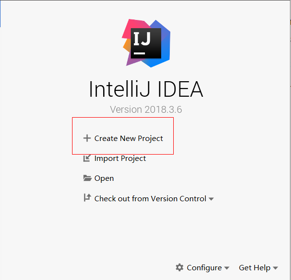
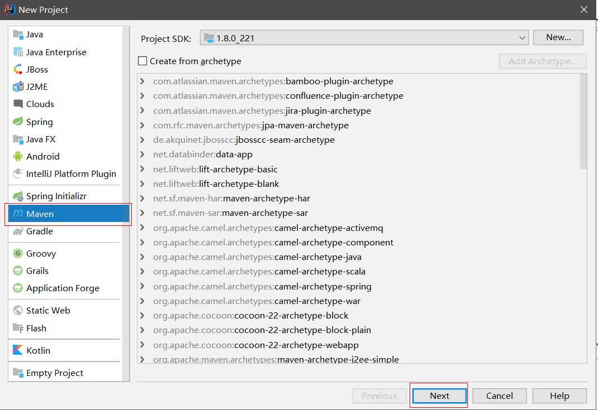
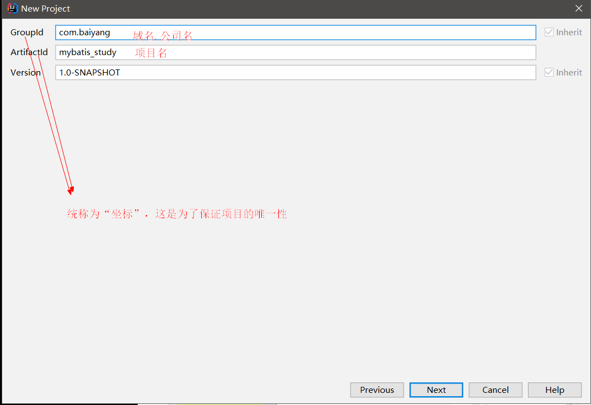
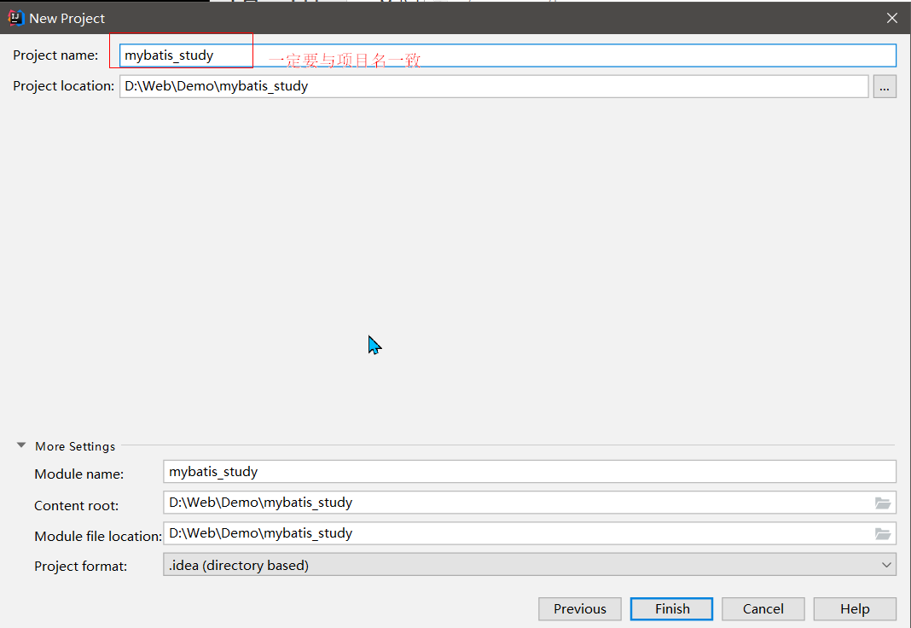
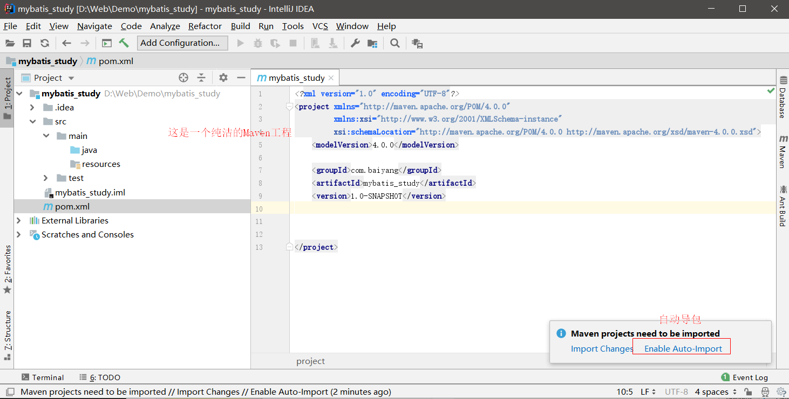
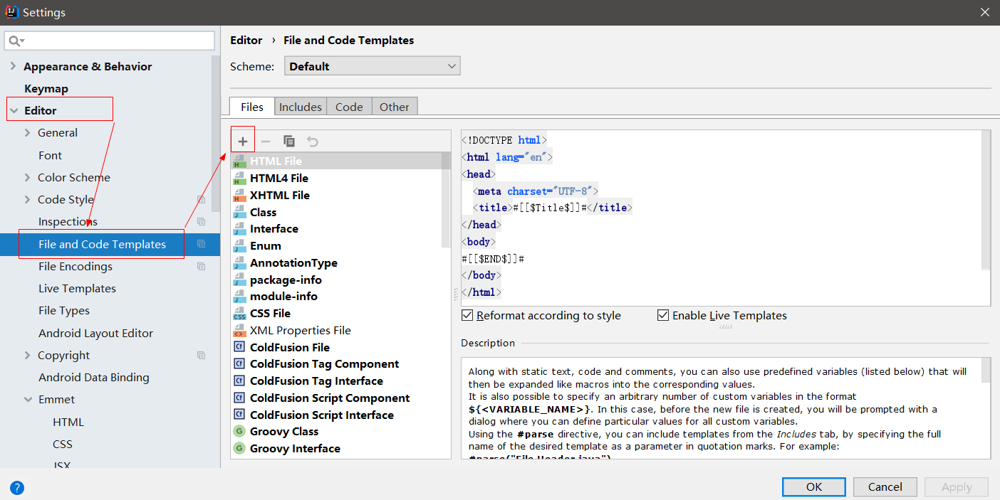
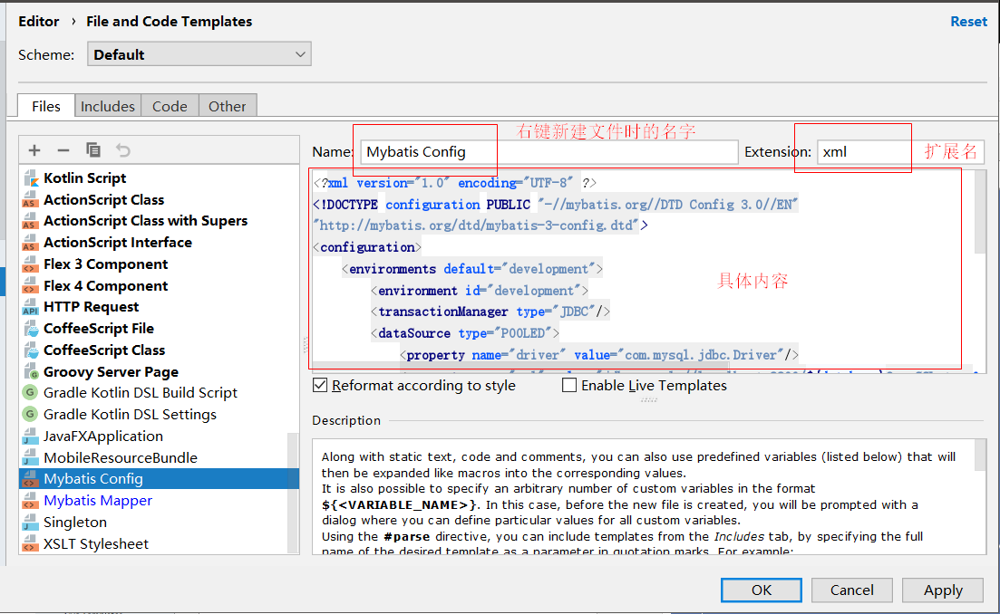
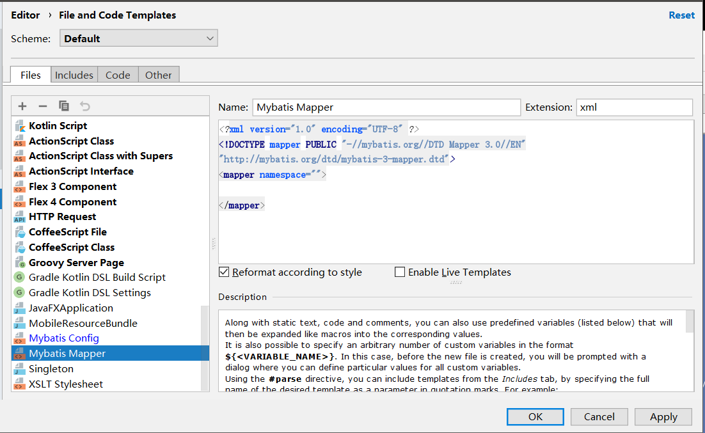
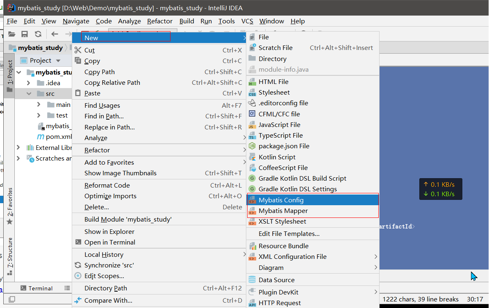
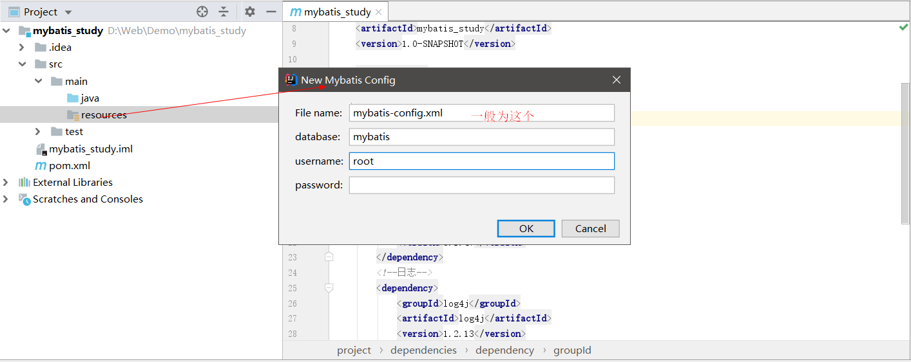

# MyBatis

## 一、简介

### 1.MyBatis是什么

MyBatis的前身叫iBatis，·在导入jar包时看得到。

是一个<font color="red">**持久层**</font>框架，或称为<font color="red">**ORM**</font>框架。

总结：

- 用来访问数据库，做数据持久化操作
- 本质上只是对JDBC进行封装，简化JDBC繁琐的操作

注：框架就是别人写好的，对某些技术进行了封装，封装成对应的jar、js、css等，我们可以直接引用，简化开发

## 2.持久层

DAO:Data Access Object数据访问对象

用来对数据进行持久化操作，如将数据存入数据库、硬盘等，可以永久保存

## 3.ORM

Object Relaltional Mapping 对象关系映射
Java程序和数据库之间的**映射关系**：

- 类————>表
- 对象————>一条数据
- 属性-———>列

## 4.回顾JDBC

JDBC操作数据库的步骤：

```java
//1.注册驱动
Class.forName(driverClassName);
//2.建立连接
Connection conn=DriverManager.getconnection（url，user，password）;
//3.创建运行SQL的语句(Statement)
Preparedstatement ps=conn.preparedstatement（sql）;
//4.运行语句->增删改查
	//增删改ps.executeupdate();
	//查ps.exeucteQuery();
Resultset rs=ps.exeucteQuery();
//5.关系映射->处理运行结果(ResultSet)
while（rs.next））{
	//行映射RowMapper 
}
//6.关闭连接，释放资源
rs.close）;
ps.close（）;
conn.close（）;
```

数据库操作中的可变部分：

- 连接信息
  - driverClassName、url、user、password（也称为数据源datasource）
- SQL语句
- RM行映射

## 二、准备工作

### 1.核心jar包

`mybatis-3.2.8.jar` 	mybatis核心包

`mysql-connector-java-5.1.24-bin.jar` 	数据库驱动

`log4j-1.2.14.jar`	日志（可选）

### 2.相关配置文件

mybatis配置文件使用的是.xml文件，分为两类：

- <font color="red">**config文件**</font>：详见第三章的第2小节
  主配置文件，在一个mybatis工程中有且只有一个

  用来配置与整个工程相关的信息，如环境配置、别名配置、插件配置、注册mapper文件等

- <font color="red">**mapper文件**</font>：详见第三章的第3小节
  映射配置文件，在一个mybatis工程中可以有多个mapper文件

  每一个mapper文件相当于原来的DAO实现

  类用来配置dao功能相关的sql操作，如sql语句、CRUD操作、字段映射等

> 由于配置文件有固定的文档声明和约束，所以可以创建自己的模板，具体操作，参考3.3 创建模板

版本说明：

- IDEA:2018.3.6
- Java:1.8
- Maven:3.5.2
- mybatis:3.5.3
- mysql:5.7
- mysql-drive


### 3.IDEA实战

#### 3.1 创建maven工程

点击`Create New Project`



点击`Maven`,再点击`Next`

> 这里没有勾选 org.apache.maven.archetypes:maven-archetype-webapp 这个模板，是因为mybatis主要进行数据库的操作，因此可以勾选Create from archetype







这里需要开启自动导包，当更新了dependency时会自动加载jar包



#### 3.2 导入jar包

在pom.xml中添加依赖如下

```xml
<?xml version="1.0" encoding="UTF-8"?>
<project xmlns="http://maven.apache.org/POM/4.0.0"
         xmlns:xsi="http://www.w3.org/2001/XMLSchema-instance"
         xsi:schemaLocation="http://maven.apache.org/POM/4.0.0 http://maven.apache.org/xsd/maven-4.0.0.xsd">
    <modelVersion>4.0.0</modelVersion>

    <groupId>com.baiyang</groupId>
    <artifactId>mybatis_study</artifactId>
    <version>1.0-SNAPSHOT</version>

    <dependencies>
        <!--Mybatis核心jar包-->
        <dependency>
            <groupId>org.mybatis</groupId>
            <artifactId>mybatis</artifactId>
            <version>3.5.3</version>
        </dependency>
        <!--数据库驱动包-->
        <dependency>
            <groupId>mysql</groupId>
            <artifactId>mysql-connector-java</artifactId>
            <version>5.1.47</version>
        </dependency>
        <!--日志-->
        <dependency>
            <groupId>log4j</groupId>
            <artifactId>log4j</artifactId>
            <version>1.2.13</version>
        </dependency>
        <!--单元测试-->
        <dependency>
            <groupId>junit</groupId>
            <artifactId>junit</artifactId>
            <version>4.12</version>
        </dependency>
    </dependencies>


</project>
```

#### 3.3 创建模板

> 创建配置文件的模板：导航栏File—->Setttings-—>Editor-->File and Code Templates



新建Mybatis Config



```xml
<?xml version="1.0" encoding="UTF-8" ?>
<!DOCTYPE configuration PUBLIC "-//mybatis.org//DTD Config 3.0//EN"
"http://mybatis.org/dtd/mybatis-3-config.dtd">
<configuration>
    <environments default="development">
        <environment id="development">
        <transactionManager type="JDBC"/>
        <dataSource type="POOLED">
            <property name="driver" value="com.mysql.jdbc.Driver"/>
            <property name="url" value="jdbc:mysql://localhost:3306/${database}?useSSL=true&amp;useUnicode=true&amp;characterEncoding=utf8"/>
            <property name="username" value="${username}"/>
            <property name="password" value="${password}"/>
        </dataSource>
        </environment>
    </environments>
    <mappers>
    <mapper resource=""/>
    </mappers>
</configuration>
```



```xml
<?xml version="1.0" encoding="UTF-8" ?>
<!DOCTYPE mapper PUBLIC "-//mybatis.org//DTD Mapper 3.0//EN"
"http://mybatis.org/dtd/mybatis-3-mapper.dtd">
<mapper namespace="">

</mapper>
```

最后的效果如下



## 三、第一个Mybatis程序

### 1.数据库设计

建议自己手敲SQL，很重要！！！

```sql
drop database if exists mybatis;

create database mybatis charset utf8;
use mybatis;


create table t_user(
	id int(32) primary key,
    name VARCHAR(50) UNIQUE  NOT NULL,
    password VARCHAR(100),
    phone VARCHAR(30),
    address VARCHAR(100)
)ENGINE=INNODB CHARSET utf8;

```

推荐使用Navicat软件来操作数据库，我使用的版本是Navicat12


### 2.主配置文件

核心配置文件，该文件一般位于src目录下，文件名可自定义，一般命名为<font color="red">mybatis-config.xml</font>

在src->main->resources目录下新建[主配置文件]，选择刚刚新建的模板中的`Mybatis Config`



#### **2.1 配置文件详解**

首推[官方文档](https://mybatis.org/mybatis-3/zh/configuration.html#)

```xml
<?xml version="1.0" encoding="UTF-8" ?>
<!DOCTYPE configuration PUBLIC "-//mybatis.org//DTD Config 3.0//EN"
        "http://mybatis.org/dtd/mybatis-3-config.dtd">
<configuration>
    <!--
        environments：配置当前工程中可能使用到的所有数据库环境,这里使用的是复数，表示会存在很多个环境
            default：指定默认使用的环境，取值为某一个environment的id
    -->
    <environments default="development">
        <!--
        environment：配置某一个数据库环境，可以有多个
            id：指定该环境的唯一标识符
        -->
        <environment id="development">
            <!--
                transactionManager：配置事务管理器
                 type：指定事务管理器的类型，取值有两种：
                     jdbc：使用简单的jdbc事务操作，如开启、提交、回滚在mybatis中，
                            默认是关闭自动提交事务的，conn.setAutocommit（false）
                     managed：将事务交给其他框架/容器来处理，如spring
                     mybatis不负责事务，什么都不会做
            -->
            <transactionManager type="JDBC"/>
            <!--
                datasource：配置数据源
                    type：配置数据源的类型，取值有三种：
                        UNPOOLED：简单的JDBC配置，未使用连接池，相当于DriverManager.getconnection（url，username，pas sword）
                        POOLED：使用连接池技术
                        JNDI：通过外部容器来获取连接
            -->
            <dataSource type="POOLED">
                <property name="driver" value="com.mysql.jdbc.Driver"/>
                <property name="url"
                          value="jdbc:mysql://localhost:3306/mybatis?useSSL=true&amp;useUnicode=true&amp;characterEncoding=utf8"/>
                <property name="username" value="root"/>
                <property name="password" value=""/>
            </dataSource>
        </environment>

    </environments>
    <!--<mappers>-->
        <!--&lt;!&ndash;-->
        <!--mapper：注册某一个mapper文件，可以有多个-->
        <!--resource属性：指定映射文件的路径，写的是相对于src的路径，使用正斜杠分隔&ndash;&gt;-->
        <!--<mapper resource=""/>-->
    <!--</mappers>-->
</configuration>
```


#### 2.2 编写测试类

在test->java->新建Test01.java

```java
import org.apache.ibatis.io.Resources;
import org.apache.ibatis.session.SqlSession;
import org.apache.ibatis.session.SqlSessionFactory;
import org.apache.ibatis.session.SqlSessionFactoryBuilder;

import java.io.IOException;
import java.io.InputStream;
import java.sql.Connection;

public class Test01 {
    public static void main(String[] args) throws IOException {
        /*
        * 创建SqlSession 称为持久化管理器，是mybatis的核心
        *
        *
        *  SqlSessionFactoryBuilder
        *   sqlSessionFactory
        *   sqlSession
        * */
        //这三行来自官网 https://mybatis.org/mybatis-3/zh/getting-started.html
        //从 XML 中构建 SqlSessionFactory

        String resource = "mybatis-config.xml";
        //MyBatis 包含一个名叫 Resources 的工具类，它包含一些实用方法，可使从 classpath 或其他位置加载资源文件更加容易。
        InputStream inputStream = Resources.getResourceAsStream(resource);
        SqlSessionFactory sqlSessionFactory = new SqlSessionFactoryBuilder().build(inputStream);

        SqlSession sqlSession = sqlSessionFactory.openSession();
        Connection connection = sqlSession.getConnection();
        System.out.println(connection);

    }
}

```

输出如下`com.mysql.jdbc.JDBC4Connection@13c78c0b`,说明连接成功

### 3.映射文件

用来配置DAO的sql操作，每个实体类对应一个映射文件，一般命名为<font color="red">XxxMapper.xml</font>，放到mapper包中

#### 3.1 创建接口文件


```java
package dao;

import entity.User;

public interface UserDao {
	//    添加用户
    public void insertUser(User user);
}

```


#### 3.2 创建映射文件


```xml
<?xml version="1.0" encoding="UTF-8" ?>
<!DOCTYPE mapper PUBLIC "-//mybatis.org//DTD Mapper 3.0//EN"
        "http://mybatis.org/dtd/mybatis-3-mapper.dtd">
<!--
    namespace属性：指定当前mapper配置文件的唯一标识符

       配置文件+接口:值必须是对应接口的全名
-->
<mapper namespace="dao.UserDao">
    <!--
    id 与接口中的函数名一致
    parameterType：输入参数类型  
    -->
    <insert id="insertUser" parameterType="entity.User">
        INSERT INTO t_user(id, name, password, phone, address)
         VALUES
          (#{id},#{name},#{password},#{phone},#{address})
   </insert>

</mapper>
```


####  3.3 编写测试类


```java
import dao.UserDao;
import entity.User;
import org.apache.ibatis.io.Resources;
import org.apache.ibatis.session.SqlSession;
import org.apache.ibatis.session.SqlSessionFactory;
import org.apache.ibatis.session.SqlSessionFactoryBuilder;

import java.io.IOException;
import java.io.InputStream;
import java.sql.Connection;

public class Test01 {
    public static void main(String[] args) throws IOException {
        /*
        * 创建SqlSession 称为持久化管理器，是mybatis的核心
        *
        *
        *  SqlSessionFactoryBuilder
        *   sqlSessionFactory
        *   sqlSession
        * */
        //这三行来自官网 https://mybatis.org/mybatis-3/zh/getting-started.html
        //从 XML 中构建 SqlSessionFactory

        String resource = "mybatis-config.xml";
        //MyBatis 包含一个名叫 Resources 的工具类，它包含一些实用方法，可使从 classpath 或其他位置加载资源文件更加容易。
        InputStream inputStream = Resources.getResourceAsStream(resource);
        SqlSessionFactory sqlSessionFactory = new SqlSessionFactoryBuilder().build(inputStream);

        SqlSession sqlSession = sqlSessionFactory.openSession();
//        Connection connection = sqlSession.getConnection();
//        System.out.println(connection);


        User user = new User(1,"baiyang","baiyang","182030930","重庆");

//        参数为接口的Class对象
        UserDao userDao = sqlSession.getMapper(UserDao.class);
        userDao.insertUser(user);
        sqlSession.commit();

    }
}

```


### 4.MybatisUtil工具类


```java
package util;

import org.apache.ibatis.io.Resources;
import org.apache.ibatis.session.SqlSession;
import org.apache.ibatis.session.SqlSessionFactory;
import org.apache.ibatis.session.SqlSessionFactoryBuilder;

import java.io.IOException;
import java.io.InputStream;

public class MybatisUtil {
    private static InputStream inputStream;
    static {
        String resource = "mybatis-config.xml";
        //MyBatis 包含一个名叫 Resources 的工具类，它包含一些实用方法，可使从 classpath 或其他位置加载资源文件更加容易。
         inputStream = null;
        try {
            inputStream = Resources.getResourceAsStream(resource);
        } catch (IOException e) {
            e.printStackTrace();
        }

    }
    public static SqlSession getSqlSession(){
        SqlSessionFactory sqlSessionFactory = new SqlSessionFactoryBuilder().build(inputStream);
        return sqlSessionFactory.openSession();
    }

    public  static  void  close(SqlSession sqlSession ){
            if (sqlSession != null) {
                sqlSession.close();
            }

    }
}

```


```java
import dao.UserDao;
import entity.User;
import org.apache.ibatis.session.SqlSession;
import util.MybatisUtil;

public class Test02 {
    public static void main(String[] args) {
        SqlSession sqlSession = MybatisUtil.getSqlSession();
        User user = new User(2,"baixue","baixue","18203092312","重庆");
        UserDao userDao = sqlSession.getMapper(UserDao.class);
        userDao.insertUser(user);

        sqlSession.commit();
        sqlSession.close();

    }
}

```


## 四、主配置文件详解

### 1.取别名typeAliases


```xml
    <!--
        配置别名 为当前工程中的某些类指定别名
    -->
    <typeAliases>
        <!--
        别名不区分大小写，但建议与类名一致
            typeAlias 为某个类配置别名
                type属性 指定类名
                alias属性 指定类的别名
        -->
        <typeAlias type="" alias="" />
        <!--
            package 为某个包下的所有类配置别名
                name属性 指定包名，该包下的所有类的别名就是其类名

        -->
        <package name=""  />
    </typeAliases>
```


### 2.引用属性文件properties


2.1 新建datasource.properties

```properties
jdbc.driver=com.mysql.jdbc.Driver
jdbc.url=jdbc:mysql://localhost:3306/mybatis?useSSL=true&amp;useUnicode=true&amp;characterEncoding=utf8
jdbc.username=root
jdbc.password=
```


2.2 插入如下一句

```xml
 <properties resource="datasource.properties" />
```


2.3 引用

`${}`

```xml
            <dataSource type="POOLED">
                <property name="driver" value="${jdbc.driver}"/>
                <property name="url"
                          value="${jdbc.url}"/>
                <property name="username" value="${jdbc.username}"/>
                <property name="password" value="${jdbc.password}"/>
            </dataSource>
```


## 五、映射文件详解

### 1.获取主键

 insert标签 中的`useGeneratedKeys="true" keyProperty="id"`属性能够让mybatis框架返回当前

> ```xml
> <!--    useGeneratedKeys 是否返回主键，默认为false 自动将返回的主键绑定到参数对象的主键属性中 
> keyProperty 指定主键-->
> ```

```xml
<insert id="getPrimary" parameterType="User" useGeneratedKeys="true" keyProperty="id" >
        INSERT INTO t_user( name, password, phone, address)
        VALUES
            (#{name},#{password},#{phone},#{address})
    </insewrt>
```

### 2.更新操作update


